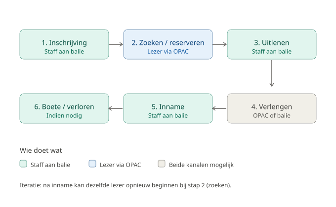
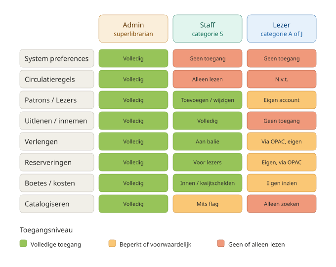
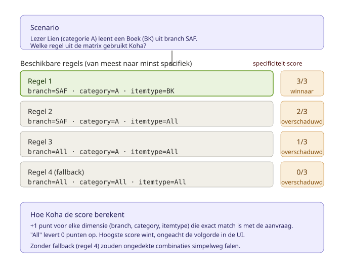
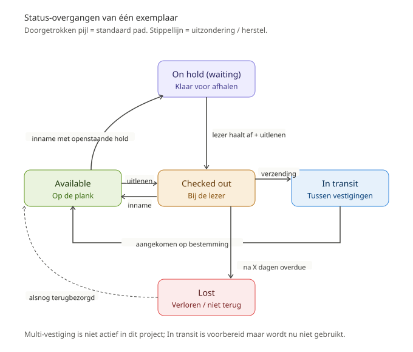
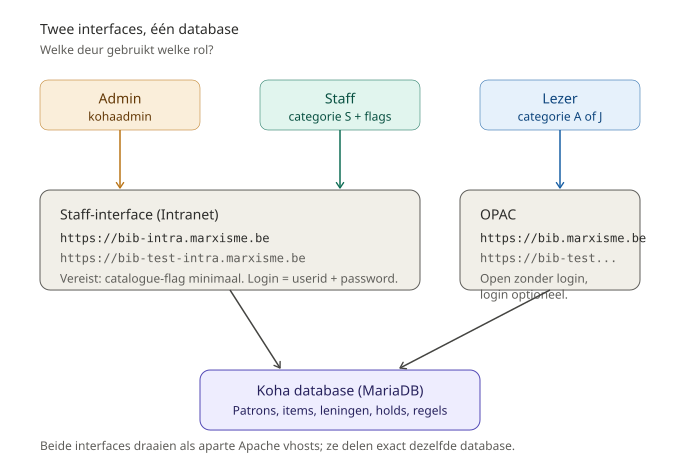

# 16. Visuele diagrammen

Dit document bundelt alle SVG-diagrammen in dit project. De bestanden zelf staan in `./diagrams/` en kunnen los hergebruikt worden in presentaties, wiki, of pdf-export.

| # | Onderwerp | Bestand |
|---|-----------|---------|
| 1 | Uitleenproces in zes stappen | `diagrams/01-uitleenproces-overzicht.svg` |
| 2 | Rollen en rechten | `diagrams/02-rollen-en-rechten.svg` |
| 3 | Specificiteit-evaluatie circulatieregels | `diagrams/03-circulatieregels-specificiteit.svg` |
| 4 | Item state machine | `diagrams/04-item-state-machine.svg` |
| 5 | Hold lifecycle | `diagrams/05-hold-lifecycle.svg` |
| 6 | Architectuur (interfaces vs database) | `diagrams/06-architectuur-interfaces.svg` |

> **Renderen in markdown:** GitHub, GitLab en de meeste markdown-viewers tonen `` tags inline. Bij export naar PDF/Word werken ze ook (mits de viewer SVG ondersteunt). VSCode preview toont ze direct.

---

## Diagram 1: Uitleenproces in zes stappen

Hoog-niveau overzicht van de zes stappen in het uitleenproces, met indicatie of de actie bij staff of OPAC plaatsvindt. Iteratief: na inname kan dezelfde lezer opnieuw beginnen.

Hoort bij: [doc 11 § 11.2](./11-uitleenproces-rollen.md).

---

## Diagram 2: Rollen en rechten

De drie rollen — Admin, Staff, Lezer — gemapped tegen acht modules met kleurcodering: groen (volledig), oranje (beperkt/voorwaardelijk), rood (geen of alleen-lezen). Snelle visuele referentie wie wat mag.

Hoort bij: [doc 11 § 11.4](./11-uitleenproces-rollen.md).

---

## Diagram 3: Specificiteit-evaluatie circulatieregels

Kernconcept van de circulatiematrix: een lezer doet een aanvraag (Lien, categorie A, leent een Boek BK in branch SAF). Welke regel uit de matrix wint? De meest specifieke. Deze visualisatie toont vier regels met hun specificiteit-score, en welke wint.

Hoort bij: [doc 13 § 13.2](./13-circulatieregels-matrix.md).

---

## Diagram 4: Item state machine

De levenscyclus van één exemplaar: van Available op de plank tot eventueel Lost, met overgangen via Checked out, On hold (waiting), en In transit. Doorgetrokken pijlen = standaard pad. Stippellijn = uitzondering / herstel.

Hoort bij: [doc 12 § S9](./12-klikpaden-stap-voor-stap.md) en [doc 13](./13-circulatieregels-matrix.md).

---

## Diagram 5: Hold lifecycle

Het volledige verloop van een reservering: twee mogelijke startpunten (lezer via OPAC of staff aan de balie), vervolgens dezelfde route via Pending → Waiting → Pickup window → ofwel afgehaald, ofwel vervallen.

Hoort bij: [doc 12 § L3 / S6](./12-klikpaden-stap-voor-stap.md) en [doc 13 § 13.3.5](./13-circulatieregels-matrix.md).

---

## Diagram 6: Architectuur — twee interfaces, één database

Welke rol gebruikt welke "deur"? Admin en Staff gebruiken het Intranet (`bib-intra`); lezers gebruiken de OPAC (`bib`). Beide zijn aparte Apache vhosts maar delen dezelfde Koha-database.

Hoort bij: [doc 2 — Architectuur](./02-architectuur.md) en [doc 11 § 11.1](./11-uitleenproces-rollen.md).

---

## Bronbestanden

Alle SVG-bestanden zijn handmatig geschreven (geen export uit een grafisch tool), zodat ze:

- Tekstueel te diffen zijn in git.
- Klein blijven (< 10 KB elk).
- Aanpasbaar zijn met een teksteditor.
- Geen externe fonts of afbeeldingen vereisen.

Wijzigen? Open het `.svg` bestand met een editor, pas waarden aan, en de wijziging is direct zichtbaar in een browser.
